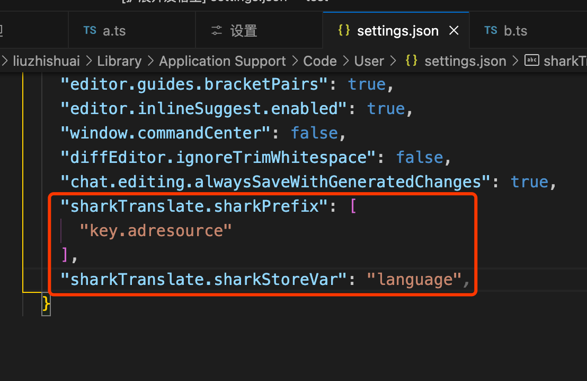

# sharkTranslate README

## Features

- 编辑器中可以选择需要翻译的中文右键-oneSharkReplace将所选内容快捷翻译成所配置的shark
- 编辑器中可以选择需要翻译的中文右键-allSharkReplace将当前文件中文快捷翻译成所配置的shark

## Requirements

- 使用前vscode setting.json 中配置：sharkTranslate.sharkPrefix（shark替换时需要删除的前缀）、sharkTranslate.sharkStoreVar（shark存储变量名，默认language无需配置）

例如：
```
 "sharkTranslate.sharkPrefix": [
      "key.adresource"
    ],
    "sharkTranslate.sharkStoreVar": "language"
```


- 需要在项目根目录下新建名称为shark.xlsx文档，并导入shark平台下载的数据，供插件读取使用。
- 上传的shark数据默认为公司shark平台提供的shark模板文档格式
